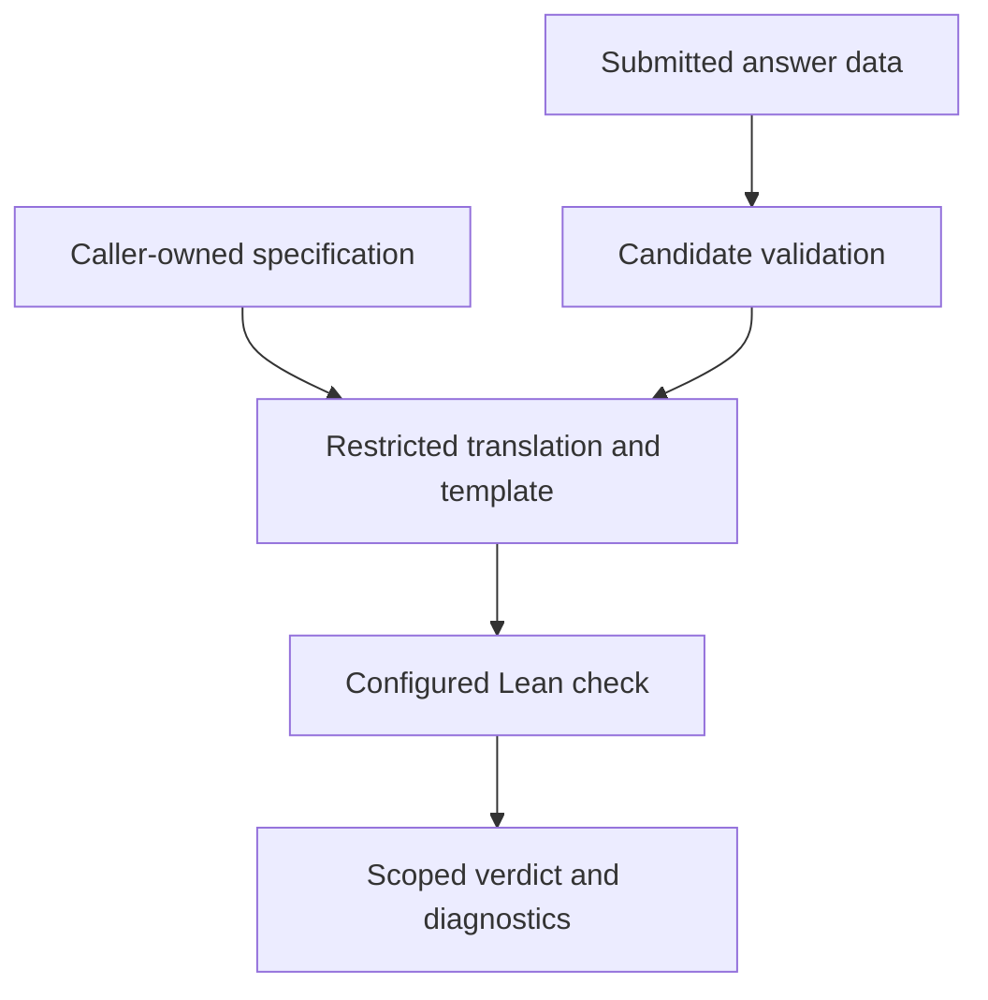

# Building a Lean-Backed Verifier for Bounded Mathematical Answers

> MathCheck Engine checks submitted answers against explicit finite specifications.
> Trusted code generates a Lean proposition; compiled decision establishes the
> encoded claim. The bounds, translation assumptions and execution outcome are
> part of what the verdict means.

Suppose a model says there are **33** integers divisible by 3 between 1 and 99.
How should a grader decide whether to accept that answer?

One option is to compare it with a stored `33`. Another is to keep the rule:
count every integer in the stated interval whose remainder modulo 3 is zero.
The second option does not need a precomputed reference answer. It needs a
specification and a checker that implements it faithfully.

MathCheck Engine explores that second interface. Its current structured
contracts cover exact evaluation, bounded sums, counts, minima and complete
relations over integer pairs. The caller owns the specification; the model
supplies answer data. Lean checks a proposition generated from both.

The interesting part is making the complete acceptance condition visible:
which domain was checked, whether an answer is merely feasible or actually
least, whether a list contains every required pair, and whether the checker
reached a decision at all.

## Replace the reference answer with a rule

Here is the specification for the opening question:

```python
from lean_kernel_verifier.specification import ProblemSpec

spec = ProblemSpec(
    kind="count",
    expression="x%3 == 0",
    start=1,
    stop=100,
)
```

The interval is half-open: `[1, 100)` includes 1 and excludes 100. For a
candidate `a`, the acceptance condition is:

$$
a = |\{x \in \mathbb{Z} : 1 \le x < 100 \land x \bmod 3 = 0\}|.
$$

There is no expected-answer field in `spec`. The candidate `33` arrives
separately. The checker enumerates the whole domain and compares its count
with that candidate.

This is answer-key-free checking, but it is not computation-free checking.
For these small finite problems, the checker often computes essentially the
same result a solver would compute. Nor is it supervision-free: someone still
has to choose the correct rule and bounds. The trusted object has changed
from a stored answer to a specification.

The distinction becomes more useful when correctness requires more than
matching a scalar.

## Feasible is not necessarily least

Consider another task:

> Find the least integer in [0, 100) that leaves remainder 3 modulo 7
> and remainder 2 modulo 5.

Both 17 and 52 satisfy the two congruences. A checker that tests only those
congruences would accept both. The word **least** adds another obligation.

Let `P(x)` denote the congruences. A candidate `a` must satisfy:

$$
0 \le a < 100
\quad\land\quad P(a)
\quad\land\quad
\forall x \in \mathbb{Z} \cap [0,100),\; x<a \Rightarrow \neg P(x).
$$

The Engine's `minimum` contract includes all three clauses:

```python
spec = ProblemSpec("minimum", "x%7 == 3 and x%5 == 2", 0, 100)
```

On a healthy backend, 17 is accepted. The candidate 52 is rejected because 17
is a smaller satisfying value. A candidate outside the interval also fails.
These are mathematical consequences of the contract, not evidence that a
particular runtime has already executed the example.

The finite bounds are part of the statement. This contract establishes
leastness within the declared interval. An unbounded question needs a
justification that its relevant solutions lie there; adding a convenient
search limit alone changes the question.

A predicate with no satisfying value exposes another boundary: the current
submission is a nonnegative integer, not a "no solution" certificate. No
integer can successfully answer that instance under the present contract.

## Follow the specification into Lean

The structured path separates what the caller trusts from what the model
may choose:



The model cannot replace the predicate, alter the bounds or submit a theorem
about an easier problem. The structured APIs generate the Lean source
themselves.

Expressions use Python's parser, but only a restricted syntax tree is
translated. There is no arbitrary `eval`. Integer literals, declared
variables, arithmetic, comparisons and Boolean connectives are supported.
Calls, imports, attributes, arbitrary identifiers and floating-point values
are rejected. Division and modulo require a positive literal divisor.

For the opening count and candidate 33, `compile_answer_check` produces the
following checking core. Whitespace is expanded here for readability; the
[complete generated file](https://github.com/stanleyngugi/mathcheck-engine/blob/main/examples/generated_count.lean) also contains the
shared template's options and arithmetic helpers.

```lean
def problem_spec (ans : Nat) : Bool := decide (
  ((List.range 99).filter (fun i =>
    let x := i + 1;
    decide ((((Int.ofNat x) % (3 : Int)) = (0 : Int)))
  )).length = ans
)

def f (_n : Nat) : Nat := if problem_spec 33 then 1 else 0

def expected : Array Nat := #[1]

theorem verify :
  (Array.range expected.size).all (fun n => f n == expected[n]!) = true := by
  native_decide
```

Here `Nat` denotes nonnegative integers, `Int` signed integers and `Bool` a
computable true/false value. `decide` turns a decidable proposition into that
Boolean test. Read the computation in four steps:

1. `List.range 99` creates indices 0 through 98. Adding 1 gives the requested
   domain, 1 through 99.
2. `filter` retains exactly the values satisfying the translated predicate.
   Its length is compared with `ans`.
3. `f` returns 1 precisely when candidate 33 passes that complete test.
4. The theorem requires that success marker. `native_decide` evaluates the
   decidable proposition to establish it.

The array `#[1]` is a shared template's success marker, not a stored
mathematical answer of 33. Scalar and pair contracts reuse this template;
finite-sequence checking uses it differently, with supplied observations.

You can inspect the source without installing Lean:

```python
from lean_kernel_verifier.specification import compile_answer_check

print(compile_answer_check(
    ProblemSpec("count", "x%3 == 0", 1, 100), 33
))
```

To execute a check, configure the runner. After following the
[isolated-runner setup](https://github.com/stanleyngugi/mathcheck-engine/blob/main/README.md#opt-in-linux-isolation), set `LEAN_BIN` to
the installed `lean-isolated` launcher:

```python
import os
from lean_kernel_verifier.runner.checker_runner import (
    CheckerRunConfig, LeanCheckerRunner,
)
from lean_kernel_verifier.specification import verify_answer

runner = LeanCheckerRunner(CheckerRunConfig(
    lean_executable=os.environ["LEAN_BIN"],
    required_lean_version=(4, 23, 0),
    timeout_seconds=210,
))
try:
    result = verify_answer(ProblemSpec("count", "x%3 == 0", 1, 100), 33, runner)
    print(result.status, result.scope)
finally:
    runner.close()
```

The result contains the candidate, specification digest, status, scope, trust
statement and checker diagnostics. Inspect the status when execution fails;
`verified=False` alone does not explain why.

## A valid pair is not a complete relation

Now suppose a task asks for every pair in `[0, 5) × [0, 5)` satisfying:

```text
x < y and x + y = 4
```

The satisfying relation is `[(0, 4), (1, 3)]`. Submitting only `(0, 4)`
provides a valid witness, but it does not provide the complete result.

```python
from lean_kernel_verifier.certificates import PairCountSpec, PairCertificate

spec = PairCountSpec("x < y and x+y == 4", 0, 5, 0, 5)
certificate = PairCertificate(((0, 4), (1, 3)), answer=2)
```

`verify_pair_certificate(spec, certificate, runner)` makes Lean construct the
entire satisfying relation in lexicographic domain order. Acceptance requires
exact equality with the submitted list and agreement with the claimed count.

| Submission | Why it fails or succeeds |
| --- | --- |
| Both pairs, count 2 | Complete relation and correct cardinality |
| Only `(0, 4)`, count 1 | Valid witness, incomplete relation |
| Both pairs, count 1 | Complete relation, wrong cardinality |
| A list containing `(2, 2)` | Includes a pair violating the predicate |
| Repeated or unsorted pairs | Violates the candidate's structural contract |

Here **certificate** means complete finite answer data. It does not mean a
compact proof or necessarily a faster verification algorithm. The checker
recomputes the relation, and the certificate can grow with its size.

Checking that every submitted pair is valid proves inclusion in the satisfying
relation. Checking list equality additionally establishes that no required
pair was omitted.

## When representation became the bottleneck

Large certificates revealed a practical problem. The original implementation
embedded the submitted relation as a large Lean list term. Even though the
mathematical domain was bounded, constructing and elaborating that source
representation became expensive.

A recorded sweep exercised sums, counts and pair relations at domain sizes
10, 100, 1,000 and 10,000, with two repetitions and both positive and negative
controls: 48 trials. The original sweep completed 44 controls; all four trials
at the largest pair size timed out.

The fix changed the representation, not the acceptance relation. Pairs are now
serialized as bounded decimal data such as:

```text
0,4;1,3
```

Lean decodes the string into an optional pair list. The acceptance condition
requires successful decoding, exact equality with the independently enumerated
relation and matching cardinality. A decoding failure cannot silently become
a successful empty list.

In the [recorded revised sweep](https://github.com/stanleyngugi/mathcheck-engine/blob/main/evaluation_records/public_v1_computational_sweep_fixed.jsonl),
all 48 controls completed with the expected outcomes and no operational
failures. The [original record](https://github.com/stanleyngugi/mathcheck-engine/blob/main/evaluation_records/public_v1_computational_sweep.jsonl)
preserves the timeouts.

These are historical observations, not a validation run of release 0.3.3 or
a controlled speedup benchmark. The repetitions did not control operating-system
cache state. The records support a narrower conclusion: the revised representation
completed the formerly failing controls in that experiment.

A bounded mathematical computation can still have an expensive representation.
A checker needs attention to both.

## Why Lean when Python can compute the same result?

Python can implement every current acceptance relation, including exhaustive
counts, leastness and complete-list equality. Removing an answer key does not
require Lean.

Lean supplies a formal language for the obligation and a proof framework in
which to establish it. That makes the generated claim inspectable and gives
the project a foundation for relating future checker computations to
mathematical definitions. It does not, by itself, demonstrate that this
implementation is faster or more reliable than a Python baseline.

Formal verification is not determined by the surface language. Python can
host a proof checker or solver, and tools such as
[Nagini](https://www.pm.inf.ethz.ch/research/nagini.html) verify a supported
Python subset against contracts. SMT solvers provide symbolic automation;
proof assistants provide logical frameworks and checking mechanisms. They
can work together, as in
[Isabelle's reconstruction of external prover results](https://isabelle.in.tum.de/library/Doc/Prog_Prove/Logic.html).

Exhaustive checking of an explicitly finite domain can establish a formal
claim. It is different from sampling a few inputs and extrapolating. The
important questions are what proposition was established, how its semantics
connect to the intended problem, and which machinery is trusted.

For this Engine, `native_decide` is the chosen computational proof mechanism.
The [Lean 4.23 reference](https://lean-lang.org/doc/reference/4.23.0/Tactic-Proofs/Tactic-Reference/#native_decide)
explains that it uses native evaluation and the `Lean.ofReduceBool` axiom.
Compiler and runtime correctness therefore matter in addition to the proof
infrastructure. This is not kernel-only reduction.

Three claims must remain distinct:

| Claim | Current position |
| --- | --- |
| This candidate satisfies this generated bounded proposition | Established by an accepted native Lean check, under its trust assumptions |
| The translation faithfully implements every supported specification | The Python translator and templates are trusted and tested; not formally verified |
| The specification faithfully represents the original prose | An upstream interpretation and review responsibility |

A theorem about the checker itself could strengthen the second connection.
That is future work, not a theorem this release claims to have proved.

The distribution name `lean-kernel-verifier` remains for 0.x compatibility.
Results label their trust model `lean_native_compiler_and_runtime`; the
package name should not imply a smaller trusted base.

## Keep execution failure separate from mathematics

A proof attempt can fail because its proposition is false. It can also fail
because a compiler cannot start, a process times out, or generated code fails
to elaborate. Those outcomes must not become the same scientific label.

The structured APIs use these execution statuses:

| Status | What it establishes |
| --- | --- |
| `checked_success` | The configured checker completed and accepted the encoded claim |
| `mathematical_rejection` | Complete recognized `native_decide` diagnostics report that the proposition evaluated to false |
| `operational_error` | Execution failed or the output does not establish a recognized decision |

Exit code 1 alone is insufficient for mathematical rejection. Engine 0.3.3
recognizes the complete negative-decision diagnostic specified by
[Lean 4.23's own regression tests](https://github.com/leanprover/lean4/blob/v4.23.0/tests/lean/run/decideNative.lean).
Unrecognized, truncated or mixed error output is conservatively operational.
This is diagnostic interpretation, not an exported mathematical counterexample;
a future diagnostic-format change can require an adapter update.

Invalid typed requests raise an input error before checking. The JSON CLI
reports handled malformed requests as `invalid_input`, rejects duplicate keys
at any object depth, and does not invoke Lean for those requests.
`unsupported_task` remains part of the shared status vocabulary, but unsupported
Engine specifications are rejected during construction; there is no runtime
contract registry dispatching that status.

The distinction matters downstream. A wrong answer and an unavailable worker
may both receive zero reward, but the latter supplies no evidence about a
model's mathematical ability. [MathCheck RL](https://github.com/stanleyngugi/mathcheck-rl)
preserves the status and avoids caching operational failures as completed verdicts.

Isolation is a separate execution property. Engine's raw runner defaults to
a configured host `lean` executable; subprocess timeouts and a lexical
sanitizer are not an operating-system sandbox. The opt-in Linux
`lean-isolated` wrapper requires Lean 4.23.0 exactly, isolates filesystem and
network access with bubblewrap, applies per-process limits and refuses an
unisolated fallback. RL requires that explicitly configured wrapper.

The wrapper is not a complete multi-tenant service design. Aggregate resource
budgets and deployment policy remain outside its per-process limits. Current
structured checks need Lean's standard infrastructure, not Mathlib.

## The supported surface and its evidence

| Contract | Submitted data | Acceptance condition |
| --- | --- | --- |
| Evaluation | Nonnegative integer | Equality with a closed integer expression |
| Sum | Nonnegative integer | Equality with the exact fold over the interval |
| Count | Nonnegative integer | Equality with the number of satisfying indices |
| Minimum | Nonnegative integer | Domain membership, feasibility and leastness |
| Pair relation | Sorted unique pair list and count | Successful decoding, complete relation equality and cardinality |

Endpoints are nonnegative and at most 1,000,000. Scalar intervals contain at
most 10,000 indices; pair rectangles contain at most 10,000 points. Expressions
have character, syntax-node and power limits. Scalar submissions lie in
`[0, 10**1000)`; negative intermediate arithmetic is supported, but negative
final answers need another submission contract. Positive literal divisors
give integer floor division and modulo; rational arithmetic is not supported.

Other repository interfaces have different meanings. The raw-source runner
checks submitted Lean under its configured policy. The historical sequence
template checks supplied finite observations, not an infinite recurrence.
Symbolic routines propose formulas or structures; they are not the structured
API's final verification authority.

The published release is [**0.3.3**](https://github.com/stanleyngugi/mathcheck-engine/releases/tag/v0.3.3).
On 2026-10-05, the unchanged joint Engine/RL gate passed on Ubuntu 24.04.4
under QEMU WHPX, using Python 3.12.3, bubblewrap 0.9.0 and stock read-only
Lean 4.23.0. The Engine suite passed **96 tests and 52 subtests**, with no
required native checks skipped. The gate also passed the isolated native
controls, repeatable wheel builds and fresh installed-package checks.

[Current validation](https://github.com/stanleyngugi/mathcheck-engine/blob/main/CURRENT_VALIDATION.md)
links the exact source revisions, commands, toolchain provenance and artifact
hashes. The [joint closeout evidence](https://github.com/stanleyngugi/mathcheck-rl/tree/main/docs/evidence/native-closeout-whpx-20261005-final)
also records downloaded release-asset verification and a fresh Linux consumer
running isolated acceptance and rejection controls. These results establish
the recorded checks on that platform; they do not establish translator
correctness for every possible input or arbitrary prose-to-specification
fidelity. The [0.3.2 release record](https://github.com/stanleyngugi/mathcheck-engine/blob/main/RELEASE_EVIDENCE_0.3.2.md)
remains available as historical evidence.

The Engine's contribution is this explicit boundary: the caller fixes a finite
mathematical contract, the model supplies data, and the checker establishes
the encoded acceptance claim under stated assumptions. Making that boundary
inspectable is useful even when the computation is simple. Preserving it
through parsing, translation and execution is where the engineering becomes
interesting.
